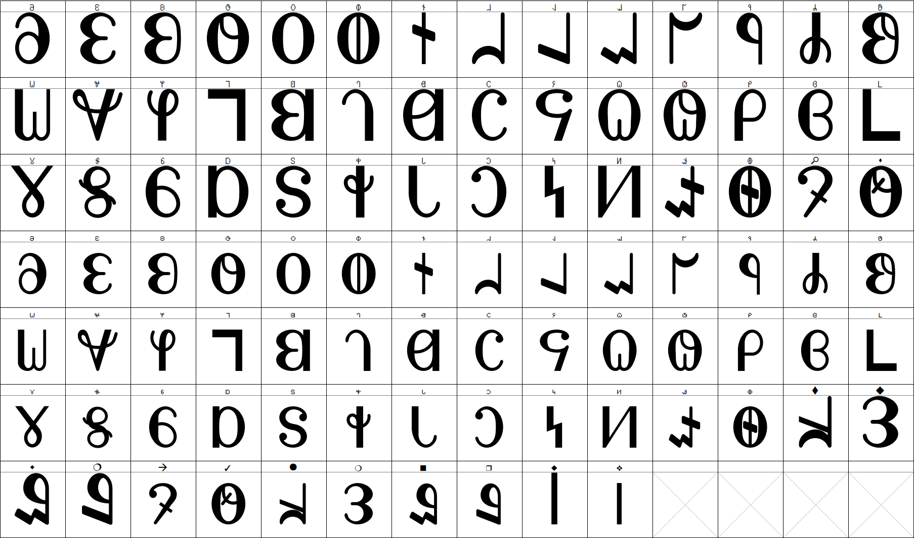

# IDC Xenoglossa

> [_Xenoglossa_](https://en.wikipedia.org/wiki/Xenoglossa) is a genus of large squash bees in the family Apidae.

```
┌─┬─┐ ╓┬──╥ ╓───╖       ╓───┐ ┌───╖ ╥     ╓───╖ ╓┬──╖ ╥     ╓───┐  ╓─┐  ╞═══╛ 
  │   ║│  ║ ║   ║       ║         ║ ║     ║   ║ ║└──╢ ║     ║   │ └╫─┘  │     
 ╘╪╕  ║└──╢ ║   ║       ╟───┐ ┌───╢ ╙───╖ ║   ║ ║   ║ ║     ╟── │  ╙─╖  │     
  │   ║   ║ ║ │ ║       ║   │ │   ║     ║ ║   ║ ║ │ ║ ║   ┐ ║   │  ┌─╫┐ │     
└─┴─┘ ╙───╨ ╙─┴─╜       ╙───┘ └───╜     ╨ ╙───╜ ╙─┴─╜ ╙───┘ ╙───┘  └─╜  ┴     

 ┬  ╥    ┬  ╥   ╓┬╖     ╓┬╥   │ ╓─╖ ┌─╖ ╓╢┐   │ ┌─╖     ╓─╖ ╓─╖ ╥   ╓─╖ ╓─╖ ╓╢┐ ╥─╖ ╞═╛ ┌─╖ 
╘╪╕ ║ ┐ ╘╪╕ ╙─╖ ║╪║     ║└╢   │ ╟─╢ ┌─╢ ╙╫┘   │ └ ║     ║│║ ║ ║ ╙─╖ ╟─╢ ║ ║ ╙╫┘ ║ ║ │     ║ 
 ┴  ╙─┘  ┴    ╨ ╙┴╜     ╙─╨ ╒═╡ ╙─╜ └─╜  ╨  ╒═╡   ╨     ╙┴╜ ╙─╜   ╨ ╙─╜ ╙─╜  ╨  ╨─╜ ┴   └─╜ 
```

A Python script to make MSDOS-style block characters in Deseret.



## Usage

```
python write.py '𐐀𐐁𐐂'
# - or -
python write.py 5 '𐐀𐐁𐐂'
```

```
┌───╖ ╓───┐ ╓───┐ 
    ║ ║     ║   │ 
┌───╢ ╟───  ╟── │ 
│   ║ ║     ║   │ 
└───╜ ╙───┘ ╙───┘ 
```
